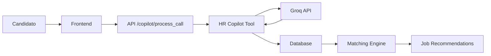

# HR Copilot Agent - Documentación

## 📋 Descripción General

El **HR Copilot** es un agente de IA que simula y analiza entrevistas iniciales de RRHH. Procesa respuestas de candidatos (texto o audio) y extrae insights estructurados como motivaciones, valores, soft skills y preferencias de equipo.

### Características principales:
- ✅ Análisis semántico con **Groq API** (llama-3.3-70b-versatile)
- ✅ Transcripción de audio con **OpenAI Whisper**
- ✅ Extracción estructurada de insights
- ✅ JSON estandarizado para integración
- ✅ Fallback automático si la API falla
- ✅ Validación y normalización de datos

---

## 🏗️ Arquitectura

```
hr_copilot/
├── hr_copilot_tool.py       # Tool MCP principal
├── prompt_templates.py      # Prompts para Groq API
├── questions.py             # Preguntas estándar de entrevista
├── audio_processor.py       # Procesamiento de audio con Whisper
├── data/                    # Casos de prueba
│   ├── answers_example_1.json
│   ├── answers_example_2.json
│   └── answers_example_3.json
└── tests/                   # Tests unitarios
    └── test_hr_copilot.py
```

---

## 🚀 Instalación

### 1. Instalar dependencias

```bash
cd backend
pip install -r requirements.txt
```

### 2. Configurar API Key

Crear archivo `.env` en la raíz del proyecto:

```env
GROQ_API_KEY=tu_api_key_aqui
```

Para obtener tu API key de Groq:
1. Visita [https://console.groq.com](https://console.groq.com)
2. Crea una cuenta
3. Ve a API Keys y genera una nueva
4. Cópiala al archivo `.env`

### 3. Verificar instalación

```bash
cd backend/app/tests
python test_hr_copilot.py
```

---

## 💻 Uso Básico

### Análisis de texto

```python
from app.services.hr_copilot.hr_copilot_tool import HRCopilotTool

# Inicializar
hr = HRCopilotTool()

# Respuestas del candidato
answers = [
    "Me motiva aprender y trabajar en equipo...",
    "Mi proyecto más importante fue...",
    "Prefiero equipos pequeños y colaborativos...",
    "Valoro la transparencia y la ética...",
    "Bajo presión mantengo la calma..."
]

# Analizar
result = hr.run(answers)

print(result)
# {
#   "motivaciones": "...",
#   "experiencia_clave": [...],
#   "valores_detectados": [...],
#   "soft_skills": [...],
#   "preferencias_equipo": "...",
#   "resumen_psicologico": "..."
# }
```

### Análisis de audio

```python
from app.services.hr_copilot.hr_copilot_tool import HRCopilotTool

hr = HRCopilotTool()

# Archivos de audio (uno por pregunta)
audio_files = [
    "respuesta_1.wav",
    "respuesta_2.wav",
    "respuesta_3.wav",
    "respuesta_4.wav",
    "respuesta_5.wav"
]

# Analizar con transcripción
result = hr.analyze_audio(audio_files, language="es")

print(result["transcriptions"])  # Textos transcritos
print(result["motivaciones"])    # Análisis semántico
```

---

## 🔌 Integración con FastAPI

El HR Copilot ya está integrado en el router `/copilot`:

```python
# backend/app/routers/copilot.py

from fastapi import APIRouter
from app.services.hr_copilot.hr_copilot_tool import HRCopilotTool

router = APIRouter()
hr = HRCopilotTool()

@router.post("/process_call")
def process_call(candidate_id: int, answers: list[str]):
    result = hr.run(answers)
    result["candidate_id"] = candidate_id
    return result
```

### Uso desde el frontend:

```python
# frontend/candidate/call_ai.py

import requests

response = requests.post(
    "http://localhost:8000/copilot/process_call",
    json={
        "candidate_id": 123,
        "answers": [
            "Respuesta 1...",
            "Respuesta 2...",
            # ...
        ]
    }
)

data = response.json()
print(data["motivaciones"])
print(data["valores_detectados"])
```

---

## 📊 Formato JSON Estandarizado

El HR Copilot devuelve **siempre** este formato:

```json
{
  "motivaciones": "String describiendo qué motiva al candidato (max 1000 chars)",
  "experiencia_clave": [
    "Experiencia 1",
    "Experiencia 2"
  ],
  "valores_detectados": [
    "innovacion",
    "colaboracion",
    "etica"
  ],
  "soft_skills": [
    "comunicacion",
    "liderazgo",
    "adaptabilidad"
  ],
  "preferencias_equipo": "Descripción del ambiente preferido (max 500 chars)",
  "resumen_psicologico": "Perfil general del candidato (max 1000 chars)"
}
```

### Valores posibles:

**valores_detectados:**
- `innovacion`, `colaboracion`, `etica`, `autonomia`
- `impacto_social`, `excelencia`, `transparencia`, `diversidad`
- `sostenibilidad`, `aprendizaje_continuo`

**soft_skills:**
- `comunicacion`, `liderazgo`, `adaptabilidad`, `resiliencia`
- `trabajo_equipo`, `pensamiento_critico`, `empatia`
- `creatividad`, `organizacion`, `proactividad`

---

## 🧪 Testing

### Ejecutar todos los tests:

```bash
cd backend
pytest app/tests/test_hr_copilot.py -v
```

### Tests disponibles:

1. **Básicos** (no requieren API key):
   - Inicialización
   - Estructura del resultado
   - Fallback con datos vacíos

2. **Con Groq API** (requieren `GROQ_API_KEY`):
   - Análisis de candidato junior
   - Análisis de candidato senior
   - Análisis de candidato mid-level
   - Consistencia de resultados

3. **Validación**:
   - Normalización de valores
   - Límites de longitud

### Ejecutar tests básicos sin API:

```bash
python backend/app/tests/test_hr_copilot.py
```

---

## 🎯 Preguntas de la Entrevista

Las preguntas estándar están en `questions.py`:

1. **Motivación**: ¿Qué te motiva de este puesto?
2. **Experiencia**: Cuéntame sobre un proyecto del que estés orgulloso
3. **Team Fit**: ¿En qué tipo de equipo te sientes más cómodo?
4. **Valores**: ¿Qué valor personal te define más?
5. **Soft Skills**: ¿Cómo manejas situaciones de presión?

Puedes personalizarlas editando el archivo.

---

## 🔧 Configuración Avanzada

### Cambiar modelo de Groq:

```python
hr = HRCopilotTool(
    model="mixtral-8x7b-32768",  # Más rápido y económico
    temperature=0.2               # Más determinístico
)
```

Modelos disponibles:
- `llama-3.3-70b-versatile` (recomendado, balance)
- `mixtral-8x7b-32768` (rápido, económico)
- `llama-3.1-8b-instant` (muy rápido, menos preciso)

### Cambiar modelo de Whisper:

```python
hr = HRCopilotTool(
    whisper_model="small"  # tiny, base, small, medium, large
)
```

---

## 📈 Integración con Base de Datos

Para guardar resultados en PostgreSQL:

```python
from app.db.session import SessionLocal
from app.models.interviews import CandidateInterview
import json

# Analizar
result = hr.run(answers)

# Guardar en DB
db = SessionLocal()
interview = CandidateInterview(
    candidate_id=candidate.id,
    answers_json=json.dumps({
        "questions": questions,
        "answers": answers
    }),
    motivations=result["motivaciones"],
    values_detected=json.dumps(result["valores_detectados"]),
    soft_skills=json.dumps(result["soft_skills"]),
    team_preferences=result["preferencias_equipo"],
    psych_summary=result["resumen_psicologico"]
)
db.add(interview)
db.commit()
```

El modelo `CandidateInterview` ya existe en `backend/app/models/interviews.py`.

---

## 🔄 Workflow Completo

### Frontend → Backend → DB:

1. **Frontend (Streamlit)**: Candidato responde preguntas
2. **API Call**: `POST /copilot/process_call`
3. **HR Copilot**: Analiza respuestas
4. **Database**: Guarda resultados
5. **Matching Engine**: Usa insights para matching



---

## 🚧 Mejoras Futuras

### Fase 2 (corto plazo):
- [ ] Análisis de emociones en audio
- [ ] Detección de confianza en respuestas
- [ ] Comparación automática entre candidatos
- [ ] Dashboard de insights agregados

### Fase 3 (medio plazo):
- [ ] Entrevista conversacional (real-time)
- [ ] Preguntas adaptativas según respuestas
- [ ] Análisis de lenguaje corporal (video)
- [ ] Recomendación de preguntas de seguimiento

### Fase 4 (largo plazo):
- [ ] Fine-tuning del modelo con datos históricos
- [ ] Predicción de performance laboral
- [ ] Detección de red flags
- [ ] Integración con sistemas ATS externos

---

## 🐛 Troubleshooting

### Error: "GROQ_API_KEY no configurada"

**Solución**: Crear archivo `.env` con tu API key.

### Error: "No module named 'groq'"

**Solución**: `pip install groq`

### Error: "Whisper model not found"

**Solución**: Asegúrate de tener suficiente espacio en disco. Whisper descarga modelos:
- tiny: ~75 MB
- base: ~142 MB
- small: ~466 MB
- medium: ~1.5 GB
- large: ~2.9 GB

### Resultados poco precisos

**Soluciones**:
1. Usar modelo más grande: `model="llama-3.3-70b-versatile"`
2. Bajar temperatura: `temperature=0.1`
3. Proporcionar respuestas más detalladas

### Transcripción en idioma incorrecto

**Solución**: Especificar idioma: `language="es"`

---

## 📚 Referencias

- [Groq API Documentation](https://console.groq.com/docs)
- [OpenAI Whisper](https://github.com/openai/whisper)
- [FastAPI Documentation](https://fastapi.tiangolo.com/)
- [MatchKey Project Docs](../../docs/planificacion/)

---

## 👥 Equipo

**Desarrollador**: Asier  
**Proyecto**: MatchKey - AI Mavericks  
**Fecha**: Noviembre 2025

---

## 📄 Licencia

Este código es parte del proyecto MatchKey y está bajo la licencia del proyecto principal.

